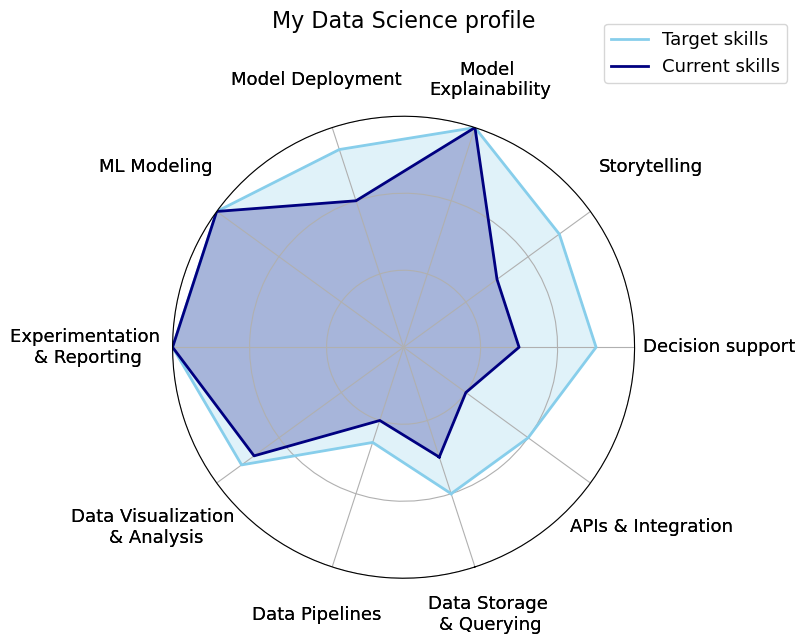

# 👋 Hi, I'm Klest Dedja

My background bridges **Applied Mathematics** and **Machine Learning**. 
During my PhD at **KULeuven** under [Prof. Celine Vens](https://kulak.kuleuven.be/~celine.vens/index.html),  
I specialized in **Explainable AI** for **Survival Analysis**, with healthcare applications.

  

---

## 🔬 Research
- [Google Scholar](https://scholar.google.com/citations?user=XXXXX)  
- [PhD Dissertation](https://lirias.kuleuven.be/retrieve/dff3deaa-efd3-45e2-833c-e6db47d88434)  
- [AL-SA Project](https://github.com/Klest94/AL-SA-paper-material)

## ⚙️ Projects
- [**Bellatrex**](https://github.com/klestdedja/bellatrex) → [PyPI](https://pypi.org/project/bellatrex/)  
- SHAP extensions for survival data  
- [**EDGEHOG**](https://github.com/klestdedja/directionality)  

## 📫 Contact
- [LinkedIn](https://www.linkedin.com/in/klest-dedja/)  
- [GitHub](https://github.com/klestdedja)  
- [Google Scholar](https://scholar.google.com/citations?user=SWJ2Y2cAAAAJ&hl=en&oi=ao)
